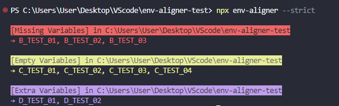

# Env Aligner

**Env Aligner** is a lightweight CLI tool that helps you validate and align environment variables between `.env` and `.env.example` files.  
It checks for missing keys, empty values, and extra variables, and optionally formats `.env` files to match the schema.

> Here's what `env-aligner` output looks like:  



## Installation

```
npm install env-aligner
```


## Features

Env Aligner recursively searches your project directories and provides the following features:

1. **Missing Key**: Detects keys defined in the schema file (e.g., `.env.example`) but missing from the `.env` file.
2. **Missing Value**: Detects variables that exist in `.env` but have no assigned value.
3. **Extra Key**: Detects keys in `.env` that are not defined in the schema file. This is only checked in **strict mode**.
4. **Align**: Automatically aligns the order and structure of the `.env` file based on the schema. This feature requires **strict mode** to be enabled.
5. **Clone**: Creates a new `.env` file based on the schema file if none exists.


## Usage
### CLI Options

| Option        | Description                                                                 | Default           |
|---------------|-----------------------------------------------------------------------------|-------------------|
| `--dir`       | Root directory to scan.                                                     | `process.cwd()`   |
| `--schema`    | Schema file name (usually `.env.example`).                                 | `.env.example`    |
| `--env`       | Env file name to validate or align.                                         | `.env`            |
| `--strict`    | Enable strict mode: warns about extra keys in `.env` not in the schema.     |     Not enabled (unless flag is present)       |
| `--align`     | Enable align mode: auto-fix `.env` format based on schema. ⚠️ Only works with `--strict`. |      Not enabled (unless flag is present)     |
| `--clone`     | Clone schema to env file if env does not exist in the folder.               |    Not enabled (unless flag is present)        |

> Examples:
```
npx env-aligner
npx env-aligner --dir .devcontainer --schema config.example --env config.env
npx env-aligner --clone
npx env-aligner --strict --align
```

---

### Programmatic Usage (Optional)
Although Env Aligner is primarily designed for use via the CLI, it also supports programmatic usage in JavaScript environments.

> ⚠️ Note: Programmatic usage is only supported in CommonJS (require) environments.  
> If your project uses "type": "module" (ESM), consider using the CLI instead.

```js title="check-env.cjs"
const envAligner = require('env-aligner')

envAligner({
  rootDir: string, // Root directory to scan (default: process.cwd())
  fileNames: {
    schemaName: string, // Schema file name (e.g., '.env.example')
    envName: string     // Env file name to validate (e.g., '.env')
  },
  mode: {
    isStrict: boolean,  // Enable strict mode (extra key detection)
    isAlign: boolean    // Enable align mode (auto format fix)
  },
  isClone: boolean       // Whether to generate the env file if missing
})
```


## Changelog
See [CHANGELOG.md](./CHANGELOG.md) for full version history.


## License

MIT © 2025 Jeremy Ho & MJC

---

Got suggestions or questions? Open an issue or drop us a message — we’d love to hear from you!