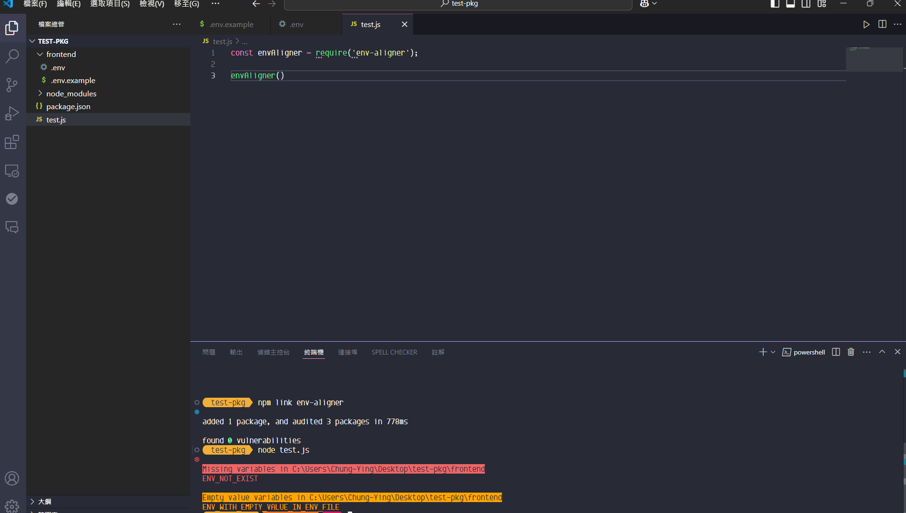

## 預期套件功能
以下皆為可選擇的功能
1. .env 缺少 .env.example 的變數時會叫
2. .env 變數缺值時會叫
3. .env 有重複變數時會叫
4. .env 有多餘變數時會叫

## 使用方式
### 在程式中引入
```
const envAligner = require('env-aligner')

// 如果想客製檢查的對象與選項
const rootDir = 'frontend' // 可以傳 'use default'，那系統會用 `process.cwd()` 作為根目錄
const customFileNamesObject = {
  schemaName: '.env.sample',
  envName: '.env.local'
}
const customCheckOptionsObject = {
  isCheckMissing: true,
  isCheckEmptyValue: true,
  isCheckDuplicate: true,
  isCheckExtra: false
}

envAligner() // 檢查預設 .env 與預設 .env.example
envAligner(rootDir, fileNames, checkOptions)
envAligner({fileNames: customFileNamesObject})
envAligner({checkOptions: customCheckOptionsObject})
```

### 在終端機中執行 (實現一半，現在前面都得加 `npx` 才能執行)
不加 `npx` 會打開 cli.js 檔案的問題需要處理掉
```bash
env-aligner // 檢查預設 .env 與預設 .env.example
env-aligner -s .env.sample -e .env.local // 檢查指定 .env.sample 與指定 .env.local
env-aligner -s .env.example // 檢查指定 .env.sample 與預設 .env
env-aligner -e .env.local // 檢查預設 .env.example 與指定 .env.local
env-aligner -m false -n false -d false -x false // 不檢查缺少、空值、重複、多餘
```

## 如何測試
1. 在本套建專案下 `npm link`
2. 建立一個測試專案 (空資料夾)
```
npm init
npm link env-aligner
```
3. 在測試專案中建一個 `test.js` 檔案
```
const envAligner = require('env-aligner')
envAligner()
```
4. 在測試專案中建一個 frontend 資料夾，並在其中建立一個 `.env` 跟 `.env.example` 檔案
- .env
```
ENV_SHOULD_PASS=pass
ENV_WITH_EMPTY_VALUE=
ENV_WITH_EMPTY_VALUE_IN_ENV_FILE=
```

- .env.example
```
ENV_SHOULD_PASS=pass
ENV_NOT_EXIST='not in env'
ENV_WITH_EMPTY_VALUE=
ENV_WITH_EMPTY_VALUE_IN_ENV_FILE='should not pass'
```

5. 在終端機中執行 `node test.js`



6. 在終端機中執行 `npx env-aligner`


